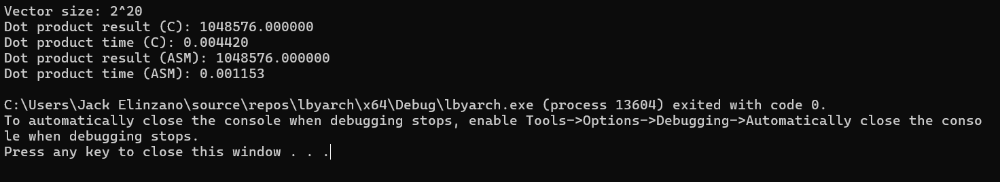
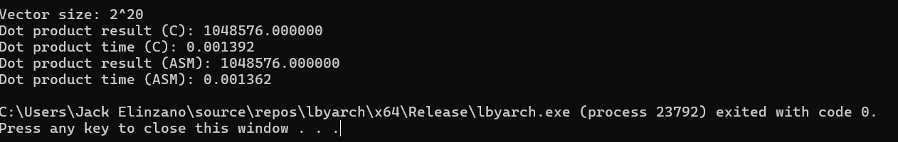
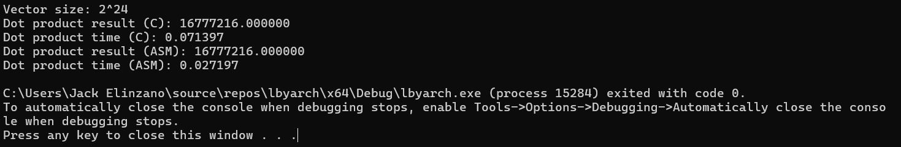
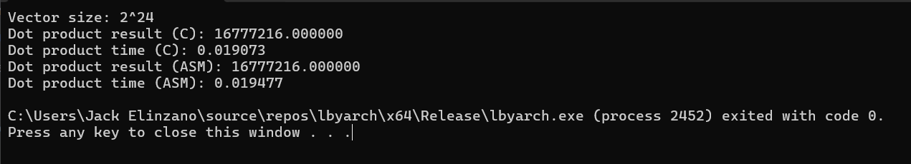
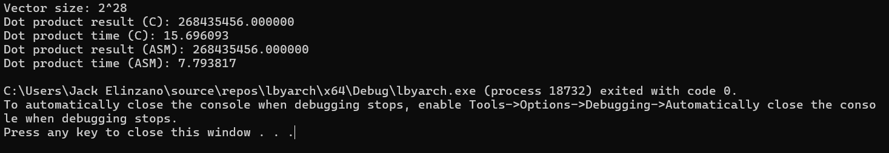
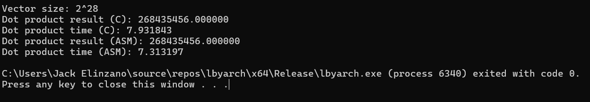

# Dot Product in C and Assembly
by: Jack Elinzano

This program tests an integer n as input and vectors A and B of the length (n) which are both double-precision float numbers. The c and assembly functions then solve the dot product of the two vectors and their execution time is printed along with the dot product of the vector. 

## Average Execution Time 
| Kernel          | C Implementation | Assembly Implementation |
|-----------------|------------------|-------------------------|
| Debug Mode (2^20) | 0.0023458        | 0.0010892                |
| Release Mode (2^20) | 0.0015138         | 0.0015682                |
| Debug Mode (2^24) | 0.0360498         | 0.0168895                |
| Release Mode (2^24) | 0.0149568         | 0.0153126               |
| Debug Mode (2^28) | 4.3060264         | 1.6599135                |
| Release Mode (2^28) | 3.032059         | 2.0692571                |

## Analysis of Results
ASM is faster for any implementation and iteration for Debug mode. This is because assembly is a generally faster language than c given its lower level. However, for Release mode, C implementation became drastically faster due to possible compiler optimizations which sped up the code for c, while assembly became quite inconsistent and was even slower than C in some tests but overall also got faster. This inconsistency from running assembly could be due to the lack of compiler optimizations that are applied to the Assembly code versus the c code. Additionally, the performance of Assembly code can be highly dependent on the specific instructions used and the efficiency of the code's execution on the target hardware.

## Photos for reference
Data of 1 was loaded through each element of both vectors to make the expected output just equal to 2^n for testing purposes.
Debug | Release
--- | ---
 | 
 | 
 | 

